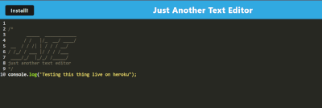
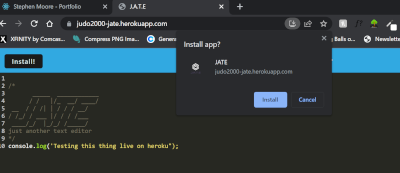
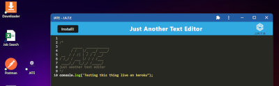

    <h3 align="center">Just Another Text Editor</h3>

## License

## Description

Given starter code for a text editor that runs in the browser it was converted into a Progressive Web Application (PWA). Using local storage the content of the editor persists on reload and works offline. Using Webpack the user can download the application and run it offline from the desktop.  
[View the live application on Heroku](https://judo2000-jate.herokuapp.com/)

## Table of Contents

- [License](#license)
- [Description](#description)
- [Table of Contents](#table-of-contents)
- [Installation Instructions](#installation-instructions)
- [Usage](#usage)
- [Contributors](#contributors)
- [Testing](#testing)
- [Questions](#questions)

  
(<a href="#top">back to top</a>)

## Installation Instructions

  <ul><li>Clone this repository byt enter this command from the command line: <code>git clone https://github.com/judo2000/jate_pwa_text_editor.git</code></li><li>Change (cd) into the newly created directory</li><li>From the command line, run the command: <code>npm i</code to install all necessary packages</li><li>From the command line, enter: <code>npm run start</code></li></ul>
  
  
(<a href="#top">back to top</a>)

  
  ## Usage
  

Open the application in the browser and enter your desired text below the header. You text will be saved. To use off-line, click the install button to save the application to the desktop.

  
(<a href="#top">back to top</a>)

  
    
  ## Contributors
  NA

  
(<a href="#top">back to top</a>)

## Testing

No tests for the project

  
(<a href="#top">back to top</a>)

## Questions

Github: [judo2000](https://github.com/judo2000) 

Email: [judo2000@comcast.net](judo2000@comcast.net)

  
(<a href="#top">back to top</a>)

